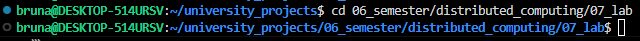
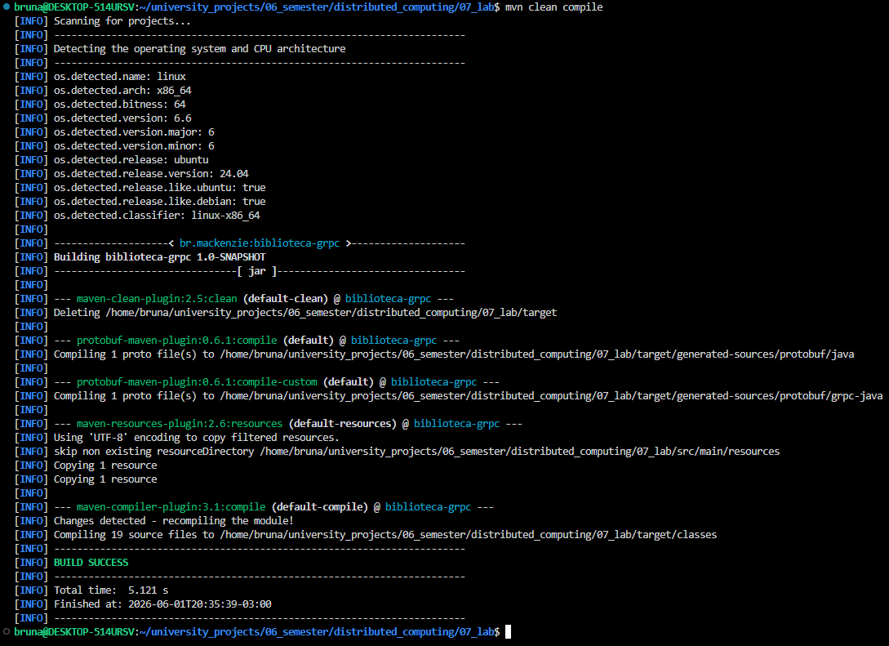
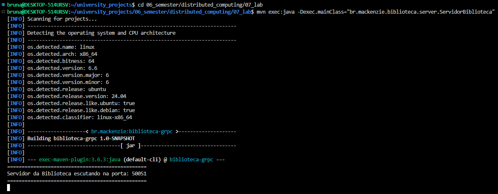
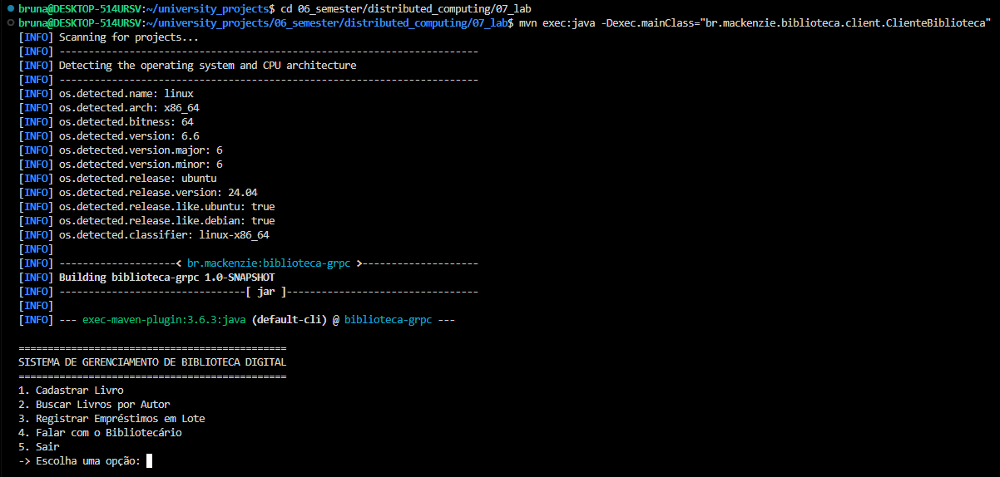

# Atividade Avaliativa — gRPC com Java

Esse projeto simula o backend de um Sistema de Gerenciamento de Biblioteca Digital distribuído, utilizadondo Java 17 + Maven + gRPC. O sistema é composto por um servidor gRPC central que oferece serviços para gerenciar livros, empréstimos e relatórios em tempo real.

## Dupla
- Bruna Gonçalves Corte David - RA: 10425696
- Júlia Andrade - RA: 10428513

## Como compilar

1. Entrar na pasta correta com ``` cd 06_semester/distributed_computing/07_lab ```
1. Compilar projeto com ``` mvn clean compile ```
2. Abrir terminal para servidor
3. No terminal do servidor, executar: ``` mvn exec:java -Dexec.mainClass="br.mackenzie.biblioteca.server.ServidorBiblioteca" ```
4. Abrir terminal para cliente
5. No terminal do cliente, executar: ``` mvn exec:java -Dexec.mainClass="br.mackenzie.biblioteca.client.ClienteBiblioteca" ```
6. Pode repetir o passo 5 e 6 seguidos quantas vezes quiser para testar com vários clientes simultaneamente

## Saída esperada

1. Se certificar de que está na pasta do projeto


1. Após executar ``` mvn clean compile ```


2. Inicializando servidor


3. Inicializando cliente
